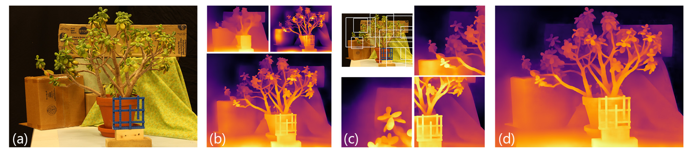
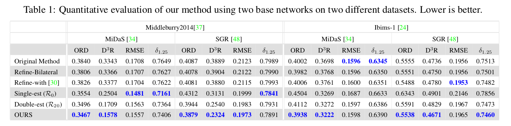

## 研究内容

单个相机拍出来的照片是很难估计它的深度的.目前主要流行用神经网络解决这个问题.但是要得到高清晰度和一个好的场景结构是很难的.目前最好的方法是全卷积架构.但受限于GPU,数据集,CNN接受域的大小.

他们观察到，随着图片的清析度越高，模型的结构越差，但是细节表现更好。他们的方法是采用一个预训练单深度估计模型实现高分辨率和高精度边缘检测.采用双估计框架合并两个图片可以得到较好的效果.第二个是从图象里面选出块放到模型里面然后再合并.

## 研究方法

 

(b) We first start with feeding the image in low- and high-resolution to the network, here shown results with MiDaS [34], and merge them to get a base estimate with a consistent structure with good boundary localization. (c) We then determine different patches in the image. We show a subset of selected patches with their depth estimates. (d) We merge the patch estimates onto our base estimate from (b) to get our final high-resolution result.

> MiDaS:一种深度估计模型，它能够从单个图像中估算出场景的深度信息。MiDaS是"Multi-scale in-depth Dataset and Model"的缩写，这表明它使用多尺度的数据来训练模型，以便更准确地理解和预测图像中每个像素的深度。这种模型在计算机视觉领域有着广泛的应用，例如在增强现实、自动驾驶汽车、3D重建以及其他需要场景理解的领域中。MiDaS模型通常通过使用大量的数据和深度神经网络来训练，以实现对复杂场景中深度信息的准确预测。

## 技术实现

### 双精度估计

选定一个低分辨率的图像作为R0。取更高分辨率的不同部分为Rx，经过模型处理后把他们和R0合并。他们实验的结果是x取20比较好。

### 块选择

大小是接受域的大小，有1/3的重叠.并且每一个块的密度是一样的.

## 模型评估

The quantitative results in Table 1 show that for the majority of the metrics, our full pipeline improves the numerical performance considerably and our double-estimation method already provides a good improvement at a small computational overhead.

 

## 局限性

单眼深度估计的局限性：该方法依赖于单眼深度估计，这本质上只能产生相对的、序数的深度值，而不是绝对深度值。这一限制影响了该方法用于精确深度分析的准确性和适用性。

噪声影响：基础模型的性能在噪声存在时会下降。文章指出，该方法在改善受噪声影响的图像方面存在挑战，这表明它对图像质量敏感。

改进的潜力：尽管存在这些挑战，该方法成功地提升了基础模型的性能。然而，作者认为，进一步研究上下文线索和完善块选择过程可能会释放预训练单眼深度估计网络的全部潜力。

## 总结 

虽然该方法在增强单眼深度估计方面显示出前景，但它面临着诸如对噪声敏感和需要进一步完善其方法以充分实现其能力等挑战。
